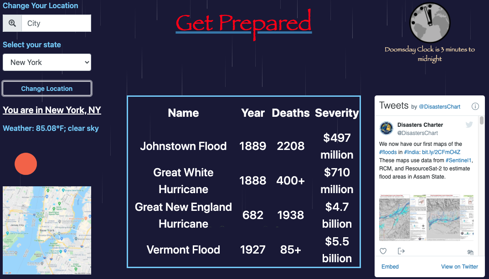

# Get Prepared
 
## Description

Get Prepared is a disaster preparation website application for disasters common in a users area and provides a disaster preparation list based on those natural disasters. This application also provides historic data on natural disasters that occured in each section of the United States. 

## Table of Contents

* [Description](#description)
* [User Story](#user-story)
* [Installation](#installation)
* [Usage](#usage)
* [License](#license)
* [Contributing](#contributing)
* [Tests](#tests)
* [Technology](#technology)
* [Collaborators](#collaborators)
* [Questions](#questions)
* [Deployed Application URL](#deployed-application-URL)

## User Story

As a user seeking disaster preparedness I want my location to be identified or be entered So that I may able to see a history of natural disasters in my area And I am given a list of most relevant survival supplies I want to be able to enter variables such as infants and number of dependents So that my list of necessities is adjusted correctly I want to be able to save a list of objects in local storage So that I may use said list to purchase objects online

## Installation

No installation needed. 

## Usage

- When the website is launched, allow the browser to access your location. Your city and state, current weather of your location, and a map of your location will be displayed. 
- In the middle of the page, you will see notable disasters that occurred in your region 
- Choose whether you have any dependents, any children, or anyone with disabilities and then click on generate list to display a survival list based on what you have chosen and what disasters are prone in your area. 
- Click on any of the items in the list and then click on add to my basket to display the items in a clickable link that will take you to google shop. 
- You can change your location by inputting a city and state and then clicking on change your location. 
- On website launch, may need to scroll down on MacOS.

## License

## Contributing

Please follow standard contributing guidelines.

## Tests

No tests to run.

## Technology

- HTML
- CSS
- JavaScript
- jQuery
- Google Maps, OpenWeatherMap, Mapquest API

## Collaborators

Kaeneth Dayao - https://github.com/kendayao

William Grundler - https://github.com/wrg93

Paul Sharpe - https://github.com/paulsharpe-git

Cyrus - https://github.com/Croatia99

## Questions

Kaeneth Dayao - https://github.com/kendayao

William Grundler - https://github.com/wrg93

Paul Sharpe - https://github.com/paulsharpe-git

Cyrus - https://github.com/Croatia99

## Deployed Application URL

Deployed application link: https://kendayao.github.io/project1/

Video demo link: https://giphy.com/gifs/jQn8VHnBVqNAeVcQhZ/fullscreen

